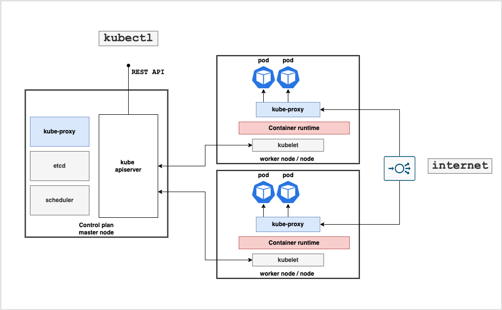

# Kubernetes intro workshop

This workshop provides a walkthrough of the basics of the Kubernetes in about 90 minutes. It was specially made for developers who aren't very familiar with Kubernetes, but understand Docker and containers. The workshops focuses on 5 core concepts:
* Create and monitor pods, deployments and services
* Create Jobs
* Use Config maps and Secrets
* Configure Limits
* Use Volumes

All you need is a web browser and access to a Kubernetes cluster. 

## Choosing an IDE 
Both Gitpod and Goople Cloud Shell are good options for this lab. 

### Gitpod
Gitpod is a developer-environment-as-a-service and this workspace is configure with:
* gcloud SDK
* kubectlx/kubens
* Vscode extensions and other things needed for the workshop 

[](https://gitpod.io/#https://github.com/nordineb/kubernetes-intro-workshop)

### Google Cloud Shell Editor

[](https://ssh.cloud.google.com/cloudshell/editor?cloudshell_git_repo=https://github.com/nordineb/kubernetes-intro-workshop.git)

## Connect to a Kubernetes cluster
You can use any Kubernetes cluster for this lab. 

### Civo 

+ Create a cluster
+ Download the config file

### GKE cluster
1. gcloud auth login
2. gcloud config set project xxxxxx
3. gcloud container clusters get-credentials xxxxxx --zone xxxxxx

```
kubectl get nodes -o wide
kubectl top node
```

## [Optional] Shell aliases
If you want to type faster, these alias are good to have
```
alias k=kubectl
alias kgp='k get po'
alias kdp='k delete po --force --grace-period=0'
alias kaf='k apply -f'
alias kdf='k delete -f'
alias kex='k explain'
alias ker='k explain --recursive'
```
Bash autocompletion:
https://kubernetes.io/docs/tasks/tools/install-kubectl/#enable-kubectl-autocompletion

## Getting started

### Kubernetes API 



#### Exploring Kubernetes API with cURL
```
APISERVER="https://XX.XX.XX.XX:6443" 

curl --insecure -X GET ${APISERVER}/api

yq  e '.users[0].user."client-certificate-data"' civo-test-kubeconfig | base64 -d > cert
yq  e '.users[0].user."client-key-data"' civo-test-kubeconfig | base64 -d > key
cat cert key

curl -s --insecure --cert cert --key key -X GET ${APISERVER}/api 

curl -s --insecure --cert cert --key key -X GET ${APISERVER}/api/v1/namespaces/kube-system/pods/
```

#### Kubectl

The default config file is stored in `$HOME/.kube/config`. 
Override with KUBECONFIG env. var. or  `--kubeconfig` flag

```
kubectl --kubeconfig civo-test-kubeconfig get pods -A
kubectl --kubeconfig civo-test-kubeconfig get pods --namespace kube-system
```

### Create a namespaces
The first thing to do is to switch to your own namespace. Don't use default namespace or one of the system namespaces. 
```
kubectl create namespace nordine
kubens nordine
```

By default `kubectl` commands only apply to the current namespace, unless "--namespace" i explicitly provided.

* When a namespace is deleted, all resources inside the namespaces are deleted
* Namespaces can have resource limits
* Resources with the same name kan be deployed into different namespoaces without conflicts.

## Creating Pods
A Pod is the smallest unit of work that Kubernetes manages and consists of 1 or more containers. Containers in a Pod run in the same "sandbox"; they use the same network namespace and can communicate together via localhost.
```
kubectl run hello-app --image=gcr.io/google-samples/hello-app:1.0
kubectl get pod -o wide
kubectl describe pod hello-app
kubectl exec --stdin --tty hello-app -- wget -O- localhost:8080
kubectl exec --stdin --tty hello-app -- /bin/sh
kubectl delete pod hello-app
```

## YAML manifests
```
kubectl run hello-app --image=gcr.io/google-samples/hello-app:1.0
kubectl get pod hello-app-nordine -o yaml
```

## Scaffold YAML using `kubectl`
We generally use `kubectl` to avoid writing YAML from scratch:
```
kubectl run hello-app --image=gcr.io/google-samples/hello-app:1.0  --dry-run=client -o yaml > mypod.yaml 
kubectl apply -f mypod.yml
```

## Create and configure Jobs and CronJobs
```
k run job --dry-run=client -o yaml --image=busybox --restart=OnFailure -- /bin/sh -c "sleep 4800" 

kubectl create cronjob nordine-cronjob --dry-run=client -o yaml --image=busybox --restart=OnFailure --schedule="*/1 * * * *" -- date 
```

## Create and configure deployments

### Replicasets 
```
kubectl apply -f k-deployment/replicaset-yaml
```
Pods are recreated when they crash or are deleted
### Scaling 
```
kubectl scale --current-replicas=1 --replicas=3 rs/frontend
```

### Deployments
```
kubectl create deployment hello-app --image=gcr.io/google-samples/hello-app:1.0 --replicas=1
```
👉 Notice how a replicaset was created

👉 Deployment can be scaled with:
```
kubectl scale --current-replicas=1 --replicas=3 deployment/hello-app
```

Inspecting deployments
```
kubectl describe deployment hello-app
kubectl logs deployment/hello-app  
kubectl get pods -o wide
kubectl get pods
```

## Create and configure services
```
kubectl expose deployment hello-app --type=NodePort --name=hello-app-nodeport --port 8080
kubectl describe services hello-app-nodeport

kubectl expose deployment hello-app --type=LoadBalancer --name=hello-app-lb --port 80  --target-port=8080
kubectl describe services hello-app-lb
```

## Limits/Quota

### namespace quotas
```
apiVersion: v1
kind: ResourceQuota
metadata:
  name: mem-cpu-example
spec:
  hard:
    requests.cpu: 2
    requests.memory: 2Gi
    limits.cpu: 3
    limits.memory: 4Gi
```
👉 When a namespace has a quota, all pods need to set a CPU request in their definition, otherwise they will not be scheduled.

### pod quotas
```
kubectl run nginx  --image=nginx --replicas=3 --requests=cpu=0.100,memory=100Mi --limits=cpu=0.2,memory=100Mi  --dry-run=client -o yaml
```

Recomended reading: https://sysdig.com/blog/kubernetes-limits-requests/

## Secrets

Configmaps & Secrets reside in a namespace and can only be referenced by Pods in that same namespace. Sync configmaps and secrets manually og use https://github.com/contentful-labs/kube-secret-syncer

```
kubectl get secret|configmap <name>  --namespace=<source-namespace> --export -o yaml | kubectl apply --namespace=<destination-namespace> -f -
```

Create a configmap
```
kubectl create configmap my-config --from-literal=PORT=8081 --from-literal=ENABLE_LOGGING=1
```

Create a secret
```
kubectl create secret generic prod-db-secret --from-literal=DB_USERNAME=admin --from-literal=DB_PASSWORD=Pass@Word2021!
```

Inspect configmaps and secrets
```
kubectl describe configmap my-config
kubectl describe secret prod-db-secret
```

Use them and inspect the pod
```
kubectl apply -f k-secrets/pod.yaml
kubectl exec --stdin --tty hello-app-nordine -- /bin/sh
```

## Volumes
Volumes are used to shared storage between all containers running in a Pod. This tutorial demonstrates how to use:
* Persisten Volume Claims and Persisten Volumes
* emptyDir
* directory-on-host

```
kubectl apply -f k-volumes/pvc.yaml
kubectl apply -f k-volumes/pod-volume-demo.yaml
kubectl exec --stdin --tty hello-app -- /bin/sh
```

## References 
https://kubernetes.io/docs/reference/kubectl/cheatsheet/

```
kubectl run --help
kubectl api-resources
kubectl api-versions
kubectl explain pods
kubectl explain pods.spec.containers.imagePullPolicy
kubectl explain pods --recursive
```


